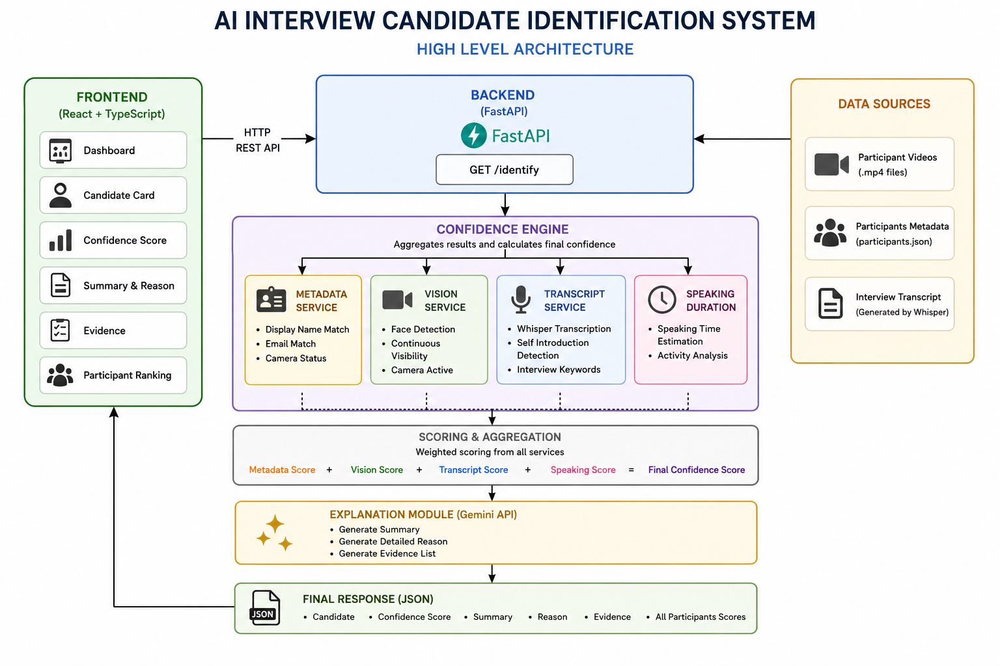

# AI Interview Candidate Identification System

An AI-powered interview candidate identification system that analyzes multiple weak signals to identify the actual interview candidate in a virtual meeting. The system combines metadata, computer vision, transcript analysis, and a confidence engine to produce an explainable confidence score.

---

# Demo

🎥 Demo Video

> https://drive.google.com/file/d/1SZjxG2tYOeQpLLah4X-4M5rqWcFLJm8X/view?usp=drive_link


# Architecture Diagram

📊 High-Level Architecture



---

# Features

- Automatic candidate identification
- Confidence score generation
- Explainable AI reasoning
- Metadata verification
- Face visibility analysis
- Transcript-based candidate detection
- Handles incorrect display names
- Handles missing metadata
- Participant ranking
- REST API using FastAPI
- Interactive dashboard built with React

---

# Tech Stack

## Frontend

- React
- TypeScript
- Vite
- Tailwind CSS

## Backend

- FastAPI
- Python

## AI Models

- OpenCV
- Whisper
- Gemini API
- Confidence Engine

---

# Project Structure

```
Sherloch-AI-Intern
│
├── backend
│   ├── app
│   │   ├── api
│   │   ├── services
│   │   ├── transcripts
│   │   ├── utils
│   │   └── main.py
│   ├── requirements.txt
│   └── .env
│
├── frontend
│   ├── src
│   ├── public
│   └── package.json
│
├── architecture.png
|__ EVALUATION.md
|
├── README.md
└── demo.mp4
```

---

# System Workflow

```
Participant Data
        │
        ▼
Metadata Analysis
        │
        ▼
Video Analysis
        │
        ▼
Transcript Generation
        │
        ▼
Confidence Engine
        │
        ▼
Explanation Module
        │
        ▼
Final Candidate Prediction
```

---

# Installation

## Clone Repository

```bash
git clone https://github.com/yourusername/sherloch-ai-intern.git

cd sherloch-ai-intern
```

---

# Backend Setup

```bash
cd backend

python -m venv venv

# Windows
venv\Scripts\activate

pip install -r requirements.txt

uvicorn app.main:app --reload
```

Backend runs at

```
http://localhost:8000
```

---

# Frontend Setup

```bash
cd frontend

npm install

npm run dev
```

Frontend runs at

```
http://localhost:5173
```

---

# Environment Variables

Create a `.env` file inside the backend folder.

```
GEMINI_API_KEY=YOUR_API_KEY
```

---

# API Endpoint

```
GET /identify
```

Returns

```json
{
  "candidate": {},
  "confidence": 95,
  "summary": "",
  "reason": "",
  "evidence": [],
  "participants": []
}
```

---

# Confidence Engine

The final confidence score is calculated by combining multiple weak signals.

### Metadata

- Display name match
- Email match
- Camera status

### Vision

- Face detected
- Visibility percentage
- Camera activity

### Transcript

- Self introduction
- Interview keywords
- Educational details
- Project discussion

### Speaking

- Estimated speaking duration

---

# Explainability

The system generates:

- Candidate summary
- Detailed reasoning
- Supporting evidence
- Confidence score

---

# Assumptions

- Participant metadata is available.
- One participant is the interview candidate.
- Videos are available locally.
- Camera remains visible during the interview.
- Whisper transcript is sufficiently accurate.

---

# Evaluation

Tested for

- Correct display name
- Incorrect display name
- Missing metadata
- Multiple participants
- Similar participant behavior
- Candidate ranking

---

# Limitations

- Uses pre-recorded interview videos.
- Speaking duration is estimated from transcript.
- Face recognition is not implemented.
- Confidence weights are rule-based.
- Gemini explanation depends on API availability and quota.

---

# Future Improvements

- Real-time meeting integration
- Speaker diarization
- Face recognition
- Voice biometrics
- Dynamic confidence updates
- Continuous learning
- Meeting platform integration (Zoom, Google Meet, Teams)

---

# Demo Deliverables

✅ Working Prototype

✅ Demo Video

✅ GitHub Repository

✅ Architecture Diagram

✅ Evaluation

---

# Author

**Tejaswini Sanam**

B.Tech CSE (AI & ML)

Sridevi Women's Engineering College
